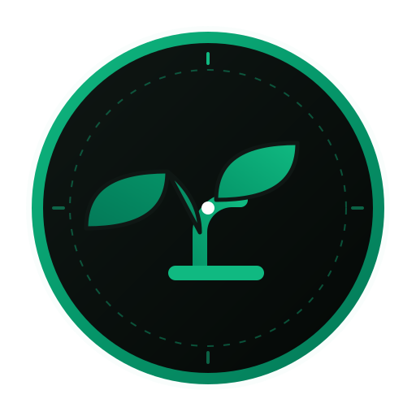

[](https://github.com/NileshKonkankar/Carbon-Compass/actions/workflows/ci.yml)

# 🧭 Carbon Compass

Carbon Compass is a premium, highly interactive, and visually stunning web application designed to help users track, understand, and reduce their daily carbon footprint. Built with React, TypeScript, and Vite, it features a modern 3D glassmorphic dark interface, dynamic SVG visualizations, personalized nudges, and gamified daily challenges.



---

## 🌟 Key Features

### 1. Daily Carbon Tracking & Budgeting
*   **Emissions Cap:** Displays a default daily carbon budget of **15.0 kg CO₂e** (standard carbon limit recommendation).
*   **Visual Gauge:** A beautifully animated SVG radial progress ring that dynamically shifts colors based on your consumption level:
    *   🟢 **Green:** Safe zone (staying well below budget)
    *   🟡 **Amber:** Approaching limit (>75% budget)
    *   🔴 **Red:** Exceeded limit (>100% budget)
*   **Day Navigation:** Easily navigate back and forth to view history or log activities for past days.

### 2. Quick Log System
Users can easily log daily activities across four key sustainability sectors:
*   🚗 **Transport:** Drive solo (gasoline car), carpool/rideshare, public bus, train/metro, and bike/walk.
*   🍔 **Diet:** Red meat meals, poultry/fish, vegetarian, and vegan options.
*   ⚡ **Energy:** Grid electricity baseline, AC or space heater operation, washing machine cycles, and eco-mode appliance settings.
*   🗑️ **Waste & Consumption:** New clothing purchases, recycling activities, food composting, and general landfill waste.

### 3. Gamified Daily Challenges & Streaks
*   **Offset Challenges:** Check off daily green habits (e.g., *Bike/Walk to Work*, *Go Plant-Based for a Day*, *Shorten Showers to 5 Mins*) to earn negative carbon offsets.
*   **Streak Tracking:** Calculates and rewards consecutive active days where the user either stays under budget or completes at least one green challenge.

### 4. Custom SVG Stacked Bar Charts
*   Toggle to the **Weekly Trends** view to inspect a beautiful, interactive stacked bar chart.
*   Displays a 7-day historic breakdown of emissions across Transport, Diet, Energy, and Waste.
*   Renders a reference dashed line for the daily budget limit.

### 5. Intelligent Insights Engine
*   Analyzes logged data on-the-fly and generates personalized recommendations (e.g., warnings about solo driving habits, meat consumption, or high energy usage).

---

## 🛠️ Tech Stack

*   **Framework:** [React 19](https://react.dev/)
*   **Bundler & Dev Server:** [Vite 8](https://vite.dev/)
*   **Language:** [TypeScript 6](https://www.typescriptlang.org/)
*   **Styling:** Vanilla CSS with custom 3D tactile panels, glassmorphic styling, and the [Outfit Google Font](https://fonts.google.com/specimen/Outfit).
*   **Icons:** Custom feather-weight SVG icon component ([Icons.tsx](src/components/Icons.tsx)).
*   **Testing:** [Vitest](https://vitest.dev/) for calculation and insight rules testing.

---

## 📂 Project Structure

```
Carbon-Compass/
├── public/                 # Static assets
├── src/
│   ├── components/         # Reusable React components
│   │   ├── AnalyticsView.tsx  # Stacked SVG bar chart & weekly averages
│   │   ├── Icons.tsx          # SVG icons registry
│   │   └── QuickLogger.tsx    # Slide-out activity logging drawer
│   ├── hooks/
│   │   └── useCarbonData.ts   # Custom state management, streaks, & local storage
│   ├── utils/
│   │   ├── carbonEngine.ts     # Carbon factors, calculations, & insights rules
│   │   └── carbonEngine.test.ts# Vitest unit test suite
│   ├── App.tsx             # Main dashboard shell & layout
│   ├── App.css             # Component-level styles
│   ├── index.css           # Global design system & glassmorphism theme
│   └── main.tsx            # Application entrypoint
├── index.html              # HTML shell
├── package.json            # Node dependencies and scripts
└── tsconfig.json           # TypeScript configuration
```

---

## 🚀 Getting Started

Follow these steps to run Carbon Compass locally.

### Prerequisites
Make sure you have [Node.js](https://nodejs.org/) installed (v18+ recommended).

### Installation
1. Clone the repository and navigate to the directory:
   ```bash
   cd Carbon-Compass
   ```

2. Install dependencies:
   ```bash
   npm install
   ```

### Running the App
Start the Vite development server:
```bash
npm run dev
```
Open your browser and navigate to `http://localhost:5173` (or the port specified in terminal).

### Running Tests
Verify calculations and recommendation rules:
```bash
npm run test
```

### Build for Production
To build the application for deployment:
```bash
npm run build
```
The output files will be generated in the `dist` directory.

---

## 🌿 Carbon Factors Reference

| Category | Activity | Factor (CO₂e) | Unit |
| :--- | :--- | :--- | :--- |
| **Transport** | Drive Solo (Gasoline Car) | `0.22 kg` | per km |
| **Transport** | Carpool / Rideshare | `0.11 kg` | per km |
| **Transport** | Public Bus | `0.08 kg` | per km |
| **Transport** | Train / Metro | `0.04 kg` | per km |
| **Transport** | Bike or Walk | `0.00 kg` | per km |
| **Diet** | Red Meat Meal | `3.20 kg` | per meal |
| **Diet** | Poultry or Fish Meal | `1.10 kg` | per meal |
| **Diet** | Vegetarian Meal | `0.60 kg` | per meal |
| **Diet** | Vegan Meal | `0.30 kg` | per meal |
| **Energy** | Grid Electricity | `0.45 kg` | per kWh |
| **Energy** | AC or Space Heater | `0.85 kg` | per hour |
| **Energy** | Laundry (Warm Wash) | `0.60 kg` | per cycle |
| **Energy** | Eco-Mode Appliances | `-0.50 kg` | per day (offset) |
| **Waste** | Bought New Clothes | `6.00 kg` | per item |
| **Waste** | Recycled Paper/Plastic | `-0.40 kg` | per day (offset) |
| **Waste** | Composted Food Waste | `-0.30 kg` | per day (offset) |
| **Waste** | General Landfill Waste | `1.50 kg` | per bag |
